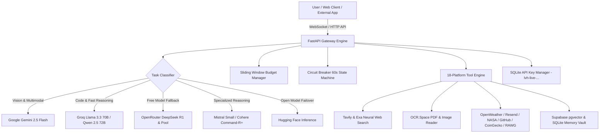

# 🔱 LEVIATHAN — Autonomous AI Entity & Multi-Provider AI Gateway

> **An Enterprise-Grade, Voice-Driven Autonomous AI Companion & Multi-Provider Failover Gateway.**
> Leviathan combines real-time voice interaction, 3D WebGL shader graphics, multi-provider rate budget management, document OCR, neural web search, vector memory, and single-channel API key generation to power external websites and AI applications.

---

## 🌟 Architecture & Capabilities Overview



---

## 🔥 Key Features & Technical Highlights

### 1. 🔱 Smart Multi-Provider AI Gateway
- **Automated Task Intent Classifier**: Automatically categorizes queries into `VISION`, `REASONING_CODE`, `LONG_CONTEXT`, `CONVERSATIONAL_FAST`, or `GENERAL`.
- **Sliding-Window Rate Budgeting**: Monitors requests-per-minute (RPM) per provider (Groq: 25 RPM, Gemini: 12 RPM, Mistral: 25 RPM, Cohere: 10 RPM, OpenRouter: 45 RPM, HuggingFace: 20 RPM) to prevent free-tier 429 quota exhaustion.
- **Circuit Breaker Engine**: Trips a 60-second cooldown on 429 errors with jittered backoff retry logic, falling over across 6 distinct LLM backends without user disruption.

### 2. 🔑 Single-Channel API Key Management (`lvh-live-...`)
- Generate custom secret API keys (`lvh-live-...`) inside the Leviathan Dashboard to power your external web applications, React frontends, mobile apps, or automation scripts.
- **OpenAI-Compatible Endpoint** (`/v1/chat/completions`): Drop-in replacement for OpenAI SDK, LangChain, or custom `fetch` clients.
- **Per-Key Sliding Window Rate Limiter**: 60 RPM safety buffer per generated key.

### 3. 🎨 Redesigned Split-Screen Canvas Workspace
- **Auto Code & Document Extraction**: When AI generates code or structured markdown documents, an interactive side panel ("Canvas Workspace") opens automatically with syntax highlighting, line numbers, one-click code copy, and file download.
- **Bento Quick Starters**: 4 empty-state prompt cards (*Build API Route*, *Cyberpunk UI Component*, *Deep Web Research*, *PDF Document Analysis*).
- **Model Telemetry Badge**: Displays real-time model telemetry (e.g. `Served via Groq Llama 3.3 70B • 180ms • Failover Active`).

### 4. 🛠️ 18 Integrated Platform Keys & Services Engine
Leviathan comes out-of-the-box with 18 fully integrated external API keys and tools:
1. **Google Gemini API** — Vision & 1M+ context window LLM.
2. **Groq AI** — Ultra-fast Llama 3.3 70B & Qwen 2.5 72B inference.
3. **OpenRouter AI Pool** — Free access to DeepSeek R1, Qwen Coder, and Llama 3.3.
4. **Mistral AI** — Mistral Small & Medium reasoning models.
5. **Cohere API** — Command-R+ chat & semantic reranking.
6. **Hugging Face API** — FLUX image generation & open models.
7. **Tavily Web Search** — Deep Web Research agent tool.
8. **Exa AI Search** — Neural Web Retrieval & page crawling.
9. **OCR.Space Engine** — Image and PDF document text extraction.
10. **OpenWeatherMap API** — Live weather & climate intelligence.
11. **Resend Email API** — Automated email dispatch.
12. **Supabase Vector Storage** — Long-term pgvector memory vault.
13. **NASA Science API** — Astronomy imagery & space data.
14. **GitHub REST API** — Code automation & repository actions.
15. **RAWG Game DB** — Gaming intelligence & database.
16. **CoinGecko API** — Real-time crypto & financial market data.

---

## 🛠️ Environment Configuration (`backend/.env`)

Create a `backend/.env` file with your credentials:

```env
# Multi-Provider AI LLM Keys
GEMINI_API_KEY=your_gemini_key
GROQ_API_KEY=your_groq_key
OPENROUTER_API_KEY=your_openrouter_key
MISTRAL_API_KEY=your_mistral_key
COHERE_API_KEY=your_cohere_key
HF_TOKEN=your_huggingface_token

# Research, Search & OCR Keys
TAVILY_API_KEY=your_tavily_key
EXA_API_KEY=your_exa_key
OCR_SPACE_API_KEY=your_ocr_space_key

# Utility & Integration Keys
OPENWEATHER_API_KEY=your_openweather_key
RESEND_API_KEY=your_resend_key
NASA_API_KEY=your_nasa_key
GITHUB_TOKEN=your_github_pat
RAWG_API_KEY=your_rawg_key
COINGECKO_API_KEY=your_coingecko_key

# Supabase Vector Vault
SUPABASE_PUBLISHABLE_KEY=your_supabase_publishable_key
SUPABASE_ANON_KEY=your_supabase_anon_key
SUPABASE_DB_URL=your_supabase_db_url

# Leviathan Master & Security
LEVIATHAN_MASTER_KEY=lvh-master-supersecretkey2026
DATABASE_URL=sqlite:///./gateway_keys.db
```

---

## 📡 API Reference & Integration

### 1. Unified Gateway Chat Endpoint (`POST /v1/chat`)

**Headers**: `X-API-Key: lvh-live-your_generated_key`

**Request Body**:
```json
{
  "prompt": "Write a production FastAPI endpoint with rate limiting",
  "model": "auto",
  "system_prompt": "You are a senior backend engineer."
}
```

**Response**:
```json
{
  "success": true,
  "reply": "```python\nfrom fastapi import FastAPI...",
  "provider": "groq",
  "task_intent": "REASONING_CODE",
  "model": "llama-3.3-70b-versatile",
  "attempts": ["groq"]
}
```

---

### 2. OpenAI SDK Compatible Endpoint (`POST /v1/chat/completions`)

```python
from openai import OpenAI

client = OpenAI(
    base_url="http://localhost:8000/v1",
    api_key="lvh-live-your_generated_key"
)

response = client.chat.completions.create(
    model="leviathan-auto",
    messages=[{"role": "user", "content": "Hello Leviathan"}]
)

print(response.choices[0].message.content)
```

---

### 3. Generate New Secret API Key (`POST /v1/keys/generate`)

**Request**:
```json
{
  "label": "My Portfolio Web App"
}
```

**Response**:
```json
{
  "success": true,
  "key_info": {
    "id": "e4a2c1b8...",
    "key": "lvh-live-a1b2c3d4e5f6...",
    "prefix": "lvh-live-a1b2...",
    "label": "My Portfolio Web App",
    "created_at": "2026-07-24T12:00:00Z"
  }
}
```

---

### 4. Lightweight Health Check (`GET /health`)

```bash
curl http://localhost:8000/health
```

**Response** (`<50 bytes` for zero-overhead cron keep-alive pings):
```json
{"status":"surfaced","gateway":"online"}
```

---

## 💻 Local Quickstart

### 1. Start FastAPI Backend

```powershell
cd backend
python -m venv .venv
.venv\Scripts\activate
pip install -r requirements.txt
uvicorn main:app --reload --port 8000
```

### 2. Start Next.js Frontend

```powershell
cd web
npm install
npm run dev
```

Open `http://localhost:3000` in your browser.

---

## 🚀 Render Cloud Deployment & Keep-Alive Cron Setup

1. **Deploy Repository**: Push your code to GitHub and link it to Render as a **Web Service**.
2. **Environment Variables**: Add all 18 keys into Render's Environment Settings.
3. **Cron Keep-Alive**: Set up a free 5-minute ping job on [cron-job.org](https://cron-job.org):
   - **URL**: `https://your-app-name.onrender.com/health`
   - **Schedule**: Every 5 minutes (`*/5 * * * *`)
   - **Expected Status**: `200 OK` (`x-render-origin-server: uvicorn`)

---

## 📜 License & Credits

Built with ❤️ by the Leviathan AI Core Team. Powered by FastAPI, Next.js 14, Three.js / React Three Fiber, LiteLLM, and Tailwind CSS.
